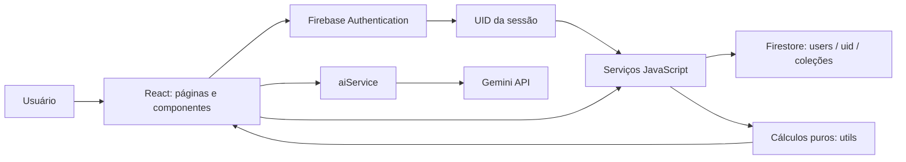

# Arquitetura e catálogo de funções do SalvaAI

[Índice](README.md) · [Comparação com o legado](evolucao-antigo-novo.md) · [Modelo de dados](migracao-de-dados.md)

## 1. Fluxo da aplicação



Não há servidor de negócio próprio nem Cloud Functions na versão atual. O Firestore aplica as regras publicadas independentemente da proteção visual das rotas. Os testes usam banco simulado ou um projeto de demonstração no emulador.

## 2. Organização

| Local | Responsabilidade |
|---|---|
| `src/main.jsx` | Recupera o tema salvo e monta React em `StrictMode` |
| `src/App.jsx` | Router, proteção de telas, providers e layout autenticado |
| `src/pages/` | Login, visão geral, histórico e assinaturas |
| `src/components/` | Blocos de apresentação, formulários, chat e drawer |
| `src/hooks/useAuth.jsx` | Sessão compartilhada e funções de autenticação |
| `src/hooks/useOperationKey.js` | Identidade da tentativa de gravação no formulário |
| `src/services/` | Integrações e coordenação de leituras/escritas |
| `src/utils/` | Regras e transformação de dados testáveis sem Firebase |
| `src/styles/global.css` | Tema, cores, layout, responsividade e componentes |
| `public/` | Ícones estáticos e favicon |
| `tests/` | Regressões de domínio e integração |
| `firestore.rules` | Regras locais de acesso/validação, ainda não publicadas nesta rodada |
| `firebase.json` | Configuração do Firestore Emulator e caminho das regras |
| `.env.example` | Exemplo de seleção do modelo Gemini |
| `dist/` | Saída gerada pelo build; não editar manualmente |

## 3. Páginas e componentes

| Página/componente | Função |
|---|---|
| `LoginPage` | Login Google/e-mail e cadastro com nome |
| `DashboardPage` | Carrega painel, abre formulários, registra pagamento e apresenta falhas |
| `HistoryPage` / `GlobalHistory` | Lista o histórico combinado e aciona estornos |
| `SubscriptionsPage` / `SubsList` | Lista/cadastra/cancela assinaturas |
| `Sidebar` | Navegação, tema, configurações de IA e logout |
| `BalanceCards` | Saldos agrupados por conta livre, VR, VA e caixinhas |
| `Lighthouse` | Saldo disponível após compromissos e barras de gastos/receitas do mês |
| `InvoiceCard` | Total corrente e ação de pagamento; bloqueia envio repetido e competência legada não conciliada |
| `GoalsList` | Progresso das metas |
| `Charts` | Rosca, linha de projeção e radar; importação dinâmica via `lazy` |
| `TransactionTable` | Seis movimentações recentes |
| `NotificationsBanner` | Avisos de fatura, vencimento, atraso e conciliação |
| `YearProjectionDrawer` | Projeção por mês; `fatura_prevista` inclui parcelas e assinaturas |
| `TransactionModal` | Receita/despesa em GENERAL, VR ou VA; leitura opcional de recibo |
| `CardTransactionModal` | Compra parcelada com indicação da primeira fatura |
| `GoalModal` | Criação de meta e aporte |
| `ImportModal` | Prévia de até dez linhas, total, erros e confirmação do lote |
| `SubModal` | Cadastro de assinatura |
| `AiSettingsModal` | Chave Gemini para o usuário atual; salvar vazio remove a chave |
| `AIAdvisor` | Insight sob demanda a partir dos dados do painel |
| `AIChatWidget` | Chat com atualização do resumo antes de cada pergunta |
| `ModalProvider` / `useModal` | Infraestrutura de `showAlert`/`showConfirm`; não substituiu todos os diálogos nativos |

## 4. Contratos dos serviços financeiros

Todos os caminhos de dados são relativos a `users/{uid}`. As funções assíncronas retornam uma Promise. Erros de validação e operação são lançados para tratamento da interface; os retornos de sucesso normalmente incluem `status: 'success'`.

### Transações — `transactionService.js`

| Função | Entrada/saída e comportamento |
|---|---|
| `createTransaction(uid, payload)` | Cria movimentação e altera saldo no mesmo commit. Retorna `transaction_id`, `applied_account` e `new_balance` |
| `getAllTransactions(uid)` | Retorna `{ status, transactions }`, juntando movimentos normais e parcelas; sem paginação |
| `deleteTransaction(uid, txnId)` | Usa prefixo `txn_` ou `ctxn_`; estorna integralmente conforme o tipo; excluir algo já excluído é um sucesso sem novo efeito |
| `getRecentTransactions(uid, limitCount = 6)` | Consulta até N registros de cada origem, combina e devolve os N mais recentes; helper disponível, o dashboard atual monta os recentes a partir de suas leituras |

Payload de criação:

```js
{
  transaction_type: 'EXPENSE', // ou INCOME
  amount: 25.50,              // reais, positivo, até 2 casas
  date: '2026-09-13',
  source_account: 'GENERAL',  // ou VR, VA
  category: 'ALIMENTACAO',
  description: 'Mercado',
  operation_id: 'identificador-estavel-da-tentativa' // opcional no serviço
}
```

### Contas — `accountService.js`

| Função | Comportamento |
|---|---|
| `getAccounts(uid)` | Lista documentos de contas com IDs |
| `getBalancesByType(uid)` | Agrupa saldos em GENERAL, VR, VA e CAIXINHA; helper disponível |
| `getOrCreateAccount(uid, type)` | Aceita GENERAL/VR/VA; reutiliza uma conta legada; bloqueia duplicidades; cria uma nova conta com ID igual ao tipo, sob transação |
| `updateBalance(uid, accountId, delta)` | Helper legado de incremento isolado. Não é usado pelos fluxos financeiros corrigidos e não deve compor uma movimentação com histórico em chamadas separadas |
| `getCaixinhas(uid)` | Lista caixinhas e progresso; helper disponível |
| `getAccountById(uid, accountId)` | Busca uma conta ou retorna `null` |

### Cartão — `cardService.js`

| Função | Comportamento |
|---|---|
| `createCardTransaction(uid, payload)` | Cria todas as parcelas atomicamente e vincula pelo `purchaseId`; aceita `amount_total`, `installments`, `purchase_date`, `category`, `description`, `current_month`, `operation_id` |
| `payInvoice(uid, month, year, operationId?)` | Relê parcelas/assinaturas dentro da transação, registra baixa e vínculos, debita GENERAL e marca itens pagos; novas compras posteriores podem ser quitadas sem repetir assinaturas |
| `getInvoiceDetails(uid)` | Retorna `{ status, invoices }`, com `month_label`, `total` e `items` |
| `getCurrentInvoiceTotal(uid)` | Retorna `{ total, month, year }`; usa o serviço de detalhes |

`getOrCreateCard(uid)` é uma função interna. Reutiliza um cartão existente ou cria `PRIMARY`; mais de um cartão bloqueia o lançamento até existir seleção/conciliação. O formulário atual não oferece cadastro/seleção de vários cartões.

### Caixinhas — `goalService.js`

| Função | Comportamento |
|---|---|
| `createGoal(uid, { name, target_value, operation_id? })` | Cria conta CAIXINHA com saldo zero e meta positiva |
| `depositToGoal(uid, goalId, value, operationId?)` | Transfere GENERAL → CAIXINHA; verifica saldo atual; grava débito/crédito e duas movimentações ligadas |

### Assinaturas — `subscriptionService.js`

| Função | Comportamento |
|---|---|
| `createSubscription(uid, { name, amount, due_day, category, operation_id? })` | Valida valor e dia; registra início no mês corrente e status ativo |
| `getActiveSubscriptions(uid)` | Retorna `{ status, subs }`; cada item inclui `id`, `name`, `amount`, `due_day` |
| `deleteSubscription(uid, subId)` | Nome mantido por compatibilidade; grava `isActive: false` e `cancelledAt` |
| `getActiveSubscriptionsTotal(uid)` | Retorna `{ total, subs }`; helper disponível |

### Importação, operações e painel

| Arquivo / função | Comportamento |
|---|---|
| `importService.js` / `importCSV(uid, csvText)` | Valida o lote completo; hashes reconhecem linhas já importadas; grava somente linhas novas com status `COMPLETED` e atualiza saldo atomicamente; retorna `insertedCount`, `skippedCount` e mensagem |
| `financialOperation.js` / `financialOperation(uid, operationId, payload, execute)` | Lê marcador de operação. Payload igual retorna resultado anterior; payload diferente com mesmo ID falha. Executa a transação e grava o marcador no mesmo commit |
| `dashboardService.js` / `getDashboardData(uid)` | Lê accounts, transactions, cardTransactions, subscriptions e invoices em paralelo; chama o cálculo puro |
| `utils/dashboard.js` / `calculateDashboard(data, now?)` | Calcula saldos, recentes, farol, projeção, gráficos, metas, alertas, período e indicação de conciliação |

Saída do painel: `balances`, `recent_transactions`, `lighthouse`, `projection_12m`, `charts`, `goals`, `notifications`, `curr_invoice`, `curr_month`, `curr_year`, `period`, `as_of`, `invoice_requires_reconciliation`, além de `status`.

## 5. Autenticação e IA

| Arquivo / função | Responsabilidade |
|---|---|
| `firebase.js` / `auth`, `db`, `googleProvider`, export default `app` | Instâncias compartilhadas do Firebase |
| `auth.js` / `loginWithGoogle()` | Login por popup; retorna sucesso/usuário ou erro |
| `auth.js` / `loginWithEmail(email, password)` | Login por e-mail/senha |
| `auth.js` / `registerWithEmail(email, password, displayName)` | Cria conta e atualiza nome |
| `auth.js` / `logout()` | Encerra sessão Firebase |
| `auth.js` / `onAuthChange(callback)` | Observa sessão e retorna função para cancelar inscrição |
| `useAuth.jsx` / `AuthProvider`, `useAuth()` | Disponibiliza user, uid, displayName, loading, isAuthenticated e ações de autenticação |
| `useOperationKey.js` / `useOperationKey()` | Retorna `keyFor(payload)` e `complete()`; a identidade é mantida em memória no formulário durante a tentativa |
| `aiService.js` / `getApiKey()`, `saveApiKey(key)`, `hasApiKey()` | Chave local por UID; não é gravada no Firestore |
| `aiService.js` / `generateFinancialInsight(data)` | Produz um insight curto a partir do resumo |
| `aiService.js` / `chatWithAI(history, message, financialContext)` | Envia pergunta e contexto com instrução de sistema |
| `aiService.js` / `extractReceiptData(base64Image, mimeType)` | Extrai JSON do recibo e passa pela validação de domínio |

A IA não grava transações, não movimenta contas e não paga faturas. A leitura de recibo apenas preenche o formulário; a confirmação continua com o usuário.

## 6. Utilitários

| Arquivo | Funções/exports e finalidade |
|---|---|
| `finance.js` | `cents`, `positiveMoney`, `sumMoney`, `addMoney`: validação e contas monetárias |
| `finance.js` | `requiredText`, `validDate`, `localDate`: texto e calendário |
| `finance.js` | `invoiceKey`, `splitInstallments`: competência e parcelas exatas |
| `finance.js` | `isTransfer`, `isInvoicePayment`, `legacyInvoiceKey`: reconhecimento de tipos e registros antigos |
| `finance.js` | `unpaidSubscriptions`: filtra assinaturas ativas/iniciadas e ainda não quitadas na competência |
| `csv.js` | `parseCSV`: parser e prévia sem gravações |
| `receipt.js` | `validateReceipt`: valida objeto, valor, data, descrição e categoria extraídos |
| `chat.js` | `completedChatHistory`: conserva até dez pares pergunta/resposta concluídos, excluindo falhas |
| `formatters.js` | `formatBRL`, `formatDateBR`, `getGreeting`, `MESES_NOMES`: apresentação |
| `categories.js` | `EXPENSE_CATEGORIES`, `INCOME_CATEGORIES`, `CARD_CATEGORIES`, `SUB_CATEGORIES`, `CATEGORY_PATTERNS`, `inferCategory`, `getCategoriesByType`: categorias e inferência por palavras-chave |

## 7. Decisões e limites arquiteturais

- Preservar valores em reais nos documentos evita uma migração silenciosa de unidade. Uma migração futura para campos inteiros deve ser explícita e versionada.
- O helper de operação não substitui regras de autorização. O UID recebido por uma função não concede acesso a outro usuário.
- A chave de operação dos formulários não sobrevive a recarregar/fechar a página. Pagamento por item e deduplicação de importação possuem proteção persistente adicional.
- `getDashboardData()` e o histórico ainda leem coleções completas. Paginação e agregações são próximas melhorias, não entregas desta rodada.
- Os helpers legados de conta e a infraestrutura de modais permanecem exportados. Sua presença não significa uso em todos os fluxos.

Fontes: [código da aplicação](../salva-ai/src/), [serviços](../salva-ai/src/services/), [testes](../salva-ai/tests/).
